# JarvisPayz Agent

**An AI-powered managed-wallet shopping agent on the Stellar network.**

JarvisPayz allows users to sign in, receive a persistent custodial smart wallet, connect authorized ecommerce stores via OAuth, and use natural-language chat to discover, compare, and purchase products -- all settled in test XLM on Stellar testnet through on-chain policy enforcement.

| | |
|---|---|
| **Live Demo** | [jarvispayz-agent.vercel.app](https://jarvispayz-agent.vercel.app) |
| **Test Merchant** | [test-market-theta.vercel.app](https://test-market-theta.vercel.app) |
| **Merchant Repository** | [github.com/sbr69/testmarket](https://github.com/sbr69/testmarket) |
| **Demo Video** | [youtu.be/3_hogOvz71U](https://youtu.be/3_hogOvz71U) |
| **Network** | Stellar Testnet (Soroban) |
| **Settlement Asset** | Native XLM (test) |
| **Status** | Testnet demonstration |

---

## Project Overview

Traditional ecommerce requires separate account sign-ins, browser wallet extensions, manual product discovery, and repeated checkout friction. An autonomous shopping agent that can browse arbitrary stores or move funds without explicit user approval introduces unacceptable risk.

JarvisPayz solves both problems:

1. **Frictionless managed wallet** -- a single identity restores the same smart wallet and balance across sessions. No browser extensions, no seed phrases.
2. **Natural-language shopping** -- users describe what they need; the agent searches only authorized merchant catalogs, recommends relevant products, and builds a basket.
3. **Exact-amount approval** -- the merchant-verified total is shown before any payment. The user must explicitly approve the specific prepared order.
4. **On-chain policy enforcement** -- every payment passes through the AgentWallet smart contract, which atomically validates merchant trust, per-transaction limits, daily spending caps, duplicate-intent protection, and available balance before transferring XLM directly to the merchant.

> This is a testnet demonstration. Every amount is test XLM. Do not use for real-money transactions.

---

## Architecture

### Three-Plane Design

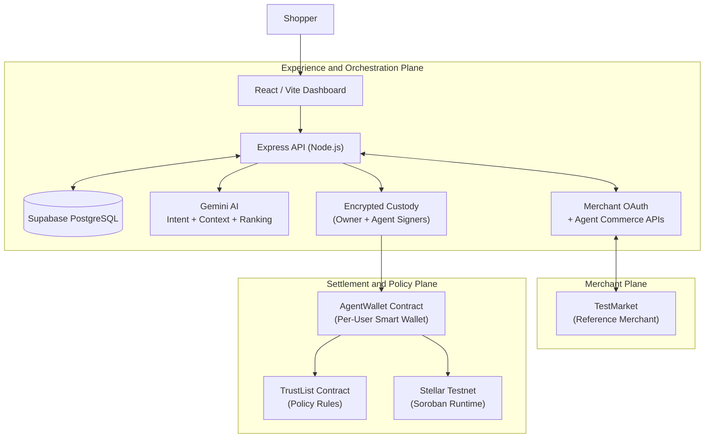

* **Experience and Orchestration Plane** -- The React dashboard and Express API handle identity (Google OAuth / Stellar wallet sign-in), chat session management, AI-driven product search and ranking, merchant OAuth connection lifecycle, basket state, checkout preparation, invoice encryption, and purchase reconciliation.
* **Merchant Plane** -- Independently deployed ecommerce stores expose OAuth authorization server metadata, agent-commerce metadata, and scoped APIs for catalog search, checkout preparation, payment confirmation, and order management. [TestMarket](https://test-market-theta.vercel.app) ([Repository](https://github.com/sbr69/testmarket)) is the reference merchant used for integration testing. JarvisPayz connects to any compatible merchant through URL discovery and standard OAuth -- there is no hard-coded merchant integration.
* **Settlement and Policy Plane** -- Per-user Soroban smart wallets hold spendable XLM. The AgentWallet contract enforces every spend against the TrustList policy contract before executing an atomic direct transfer to the merchant. No escrow, no intermediary.

### End-to-End Payment Flow

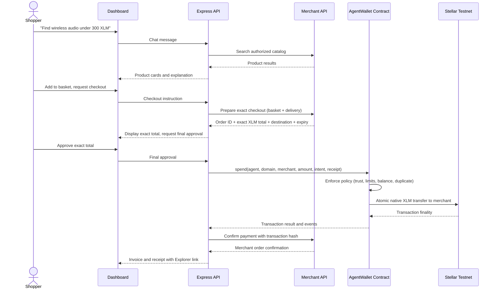

### Commerce State Machine

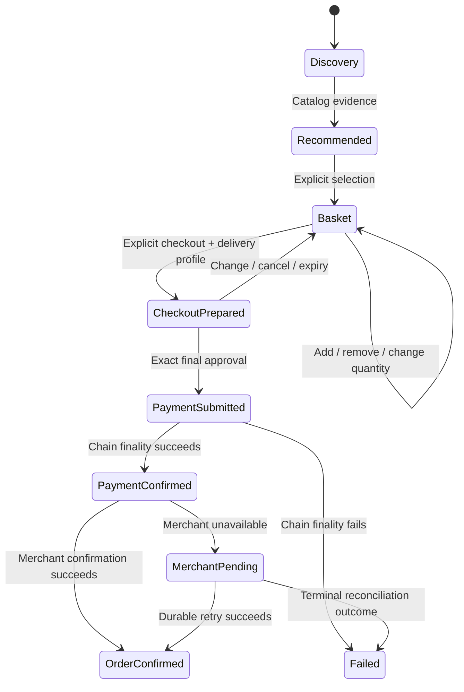

Each state transition is gated by explicit user action. The agent cannot advance from search to payment without the user's checkout instruction and final approval of the exact merchant-quoted amount.

---

## Core Features & Security Model

### Managed Wallet & Encrypted Custody
* **Dual-Signer Security Model:** The backend maintains encrypted owner and agent signer keys (encrypted at rest using AES-256-GCM under separate derivations). Transactions must be co-authorized by both key derivations to proceed.
* **Persistent Identity:** Signing in with Google restores the user's persistent Agent Smart Wallet (`C...` address) and balance across sessions—no browser extensions, private key configurations, or seed phrases are needed.
* **Budgets & Spending Controls:** Users configure budget limits (per-purchase cap and daily budget) on the frontend Dashboard, which are synced directly into the smart contract rules.

### Constrained Agent Intelligence
* **Intent-Bound Actions:** The LLM (Google Gemini) is strictly limited to parsing chat intents and ranking catalog matches. All checkout state transitions, quotes, and contract interactions are deterministic, typed backend logic.
* **Store Connection via OAuth:** The agent only searches merchant catalogs that the user has explicitly connected via OAuth 2.0 with PKCE (S256) discovery.

---

## Smart Contracts

The smart contracts are written in Rust targeting the Soroban runtime (`soroban-sdk 25.0.1`).

### AgentWallet
A per-user programmable wallet holding spendable XLM. It exposes:
* `constructor(owner, agent, token, trust_list)`: Deploys the wallet and sets signers.
* `spend(agent, domain_hash, merchant, amount, intent_hash, receipt_hash)`: Executes direct merchant payment. Requires dual-signatures (owner + agent) and checks on-chain spending limits.
* `withdraw(owner, recipient, amount)` & `set_agent(owner, agent)`: Owner-authorized recovery functions.

### TrustList
A policy registry mapping `(owner, domain_hash)` to merchant trust rules:
* Ensures payments are sent to a trusted, active merchant address matching the store's domain.
* Enforces structural caps (`daily_limit`, `per_transaction_limit`) directly on-chain.

---

## Contract Addresses

> Deployed on Stellar Testnet (Soroban).

| Contract | Address |
|---|---|
| TrustList (Policy) | [`CCF7TJNLJUFTQYQSJH3BUBF6E6DPWGG4T6LIH5PVET4TJKOMNIHDEZKK`](https://stellar.expert/explorer/testnet/contract/CCF7TJNLJUFTQYQSJH3BUBF6E6DPWGG4T6LIH5PVET4TJKOMNIHDEZKK) |
| Native XLM Stellar Asset Contract | [`CDLZFC3SYJYDZT7K67VZ75HPJVIEUVNIXF47ZG2FB2RMQQVU2HHGCYSC`](https://stellar.expert/explorer/testnet/contract/CDLZFC3SYJYDZT7K67VZ75HPJVIEUVNIXF47ZG2FB2RMQQVU2HHGCYSC) |
| AgentWallet WASM | `892f964953c5bb9fa2ebfe41b42e05f9f78c145fd6fc4482fc134ec4542d979b` |

---

## User Wallet Interactions

Proof of 10+ user wallet interactions on the Stellar testnet. Each address and hash links to its active page on Stellar Expert.

| Sl No. | Login Method | Agent's Wallet Address | Tx Hash |
| :---: | :---: | :--- | :--- |
| 1 | Google | [`CDFACHLS...`](https://stellar.expert/explorer/testnet/contract/CDFACHLSKLZI6SZYHPTBCXAKH2VH6CCP73OVVA4IDERITH7ATQ5EFMLH) | [`56b910e3d...`](https://stellar.expert/explorer/testnet/tx/56b910e3d09334f9ec118653d8413834524de0b99bd020a8b23a605b31cba6fa) |
| 2 | Google | [`CBTXDCNJ...`](https://stellar.expert/explorer/testnet/contract/CBTXDCNJ47LG32YREVKXFXGE55IWBYHZ5UNI5DX7WVAMD5J65GCZLAJQ) | [`d48ae8b9e...`](https://stellar.expert/explorer/testnet/tx/d48ae8b9ec8abaef511c6b7b6739f4ac22f3765422910a5ac066e07b7738b19a) |
| 3 | Google | [`CAVXKUZN...`](https://stellar.expert/explorer/testnet/contract/CAVXKUZNBDWMEEKEFNNRUVZOY2V5J2TIMJQ7UTJPQDE35JJ3SKDYNY6Q) | [`9bd81a18f...`](https://stellar.expert/explorer/testnet/tx/9bd81a18f88c08fac800747829c5fa7b3dcad5a6daf8b78e186eb9e072a3cb83) |
| 4 | Wallet | [`CDAXFCA5...`](https://stellar.expert/explorer/testnet/contract/CDAXFCA5ZHIXJ3UQIRLMDD7M42Y3WMJWJEJMROYMD3JFCXQJNWJKITER) | [`bd3c53b72...`](https://stellar.expert/explorer/testnet/tx/bd3c53b728c86c4c9ae5dae4deb90f8bbf901ab0ad64d5b5e0d664164d172088) |
| 5 | Google | [`CAB2T3KC...`](https://stellar.expert/explorer/testnet/contract/CAB2T3KC7RFO2ARVRGX5QM7X6COOKJILDM3EJWVF24GGZWUFUPPBROUE) | [`c1c1686dc...`](https://stellar.expert/explorer/testnet/tx/c1c1686dc0eb647f490b355fb628635e13eeb17addde19e5b478ade932022bdf) |
| 6 | Google | [`CB4RTF3H...`](https://stellar.expert/explorer/testnet/contract/CB4RTF3HZ3UPYYJX5X7ILGQYJXU3Y67VCWOMGCKAASJUCU233TFVEE4Z) | [`325e46a06...`](https://stellar.expert/explorer/testnet/tx/325e46a069275d5c15933731960615387ee50e8192931c7a26255200976d2fe2) |
| 7 | Google | [`CDJKMCOJ...`](https://stellar.expert/explorer/testnet/contract/CDJKMCOJAIRA5REUYG575DP2DV5NSCYI7QAU4DUW6VIBOMWCKKVWE3FF) | [`910032bfb...`](https://stellar.expert/explorer/testnet/tx/910032bfb9a94f11410d823acc110b4ab1a218cadc3e1ebf0fe324e956f6723f) |
| 8 | Google | [`CCAJL7SJ...`](https://stellar.expert/explorer/testnet/contract/CCAJL7SJDHC4SOCZO7DSIOZRTWBTDGSFBNJQL4OAGP7CQTDGOQYOLRAV) | [`45ac44ba9...`](https://stellar.expert/explorer/testnet/tx/45ac44ba9a6219e318f9ab928a718e33a778b127c72c979106766d6b527e70c5) |
| 9 | Wallet | [`CCSMAFS6...`](https://stellar.expert/explorer/testnet/contract/CCSMAFS6QE3C6J6D6EGKBFPK6ZMCD7ZSKXSHWDHKO635BWSCQHFVUZAR) | [`d3b81969a...`](https://stellar.expert/explorer/testnet/tx/d3b81969affd63b915dbebc799df0eff0e958adef34610bef4f66d070bc5a2a5) |
| 10 | Wallet | [`CDVVJSHB...`](https://stellar.expert/explorer/testnet/contract/CDVVJSHBF2C2ZBFTO2HN5J7AFTGLEMPRN2E6ZLLLGZC4RAY774XAZ52S) | [`191f4fd1c...`](https://stellar.expert/explorer/testnet/tx/191f4fd1cb043458ec3f113438bdb0ec023722f80fc2b8e73c3f4e823ed9897d) |

---

## Screenshots

### Product UI -- Desktop

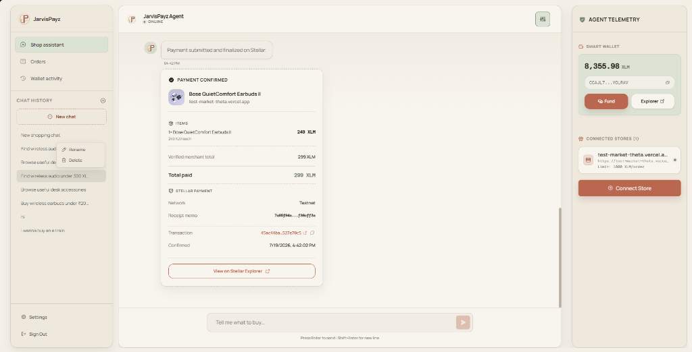

### Mobile Responsive Design

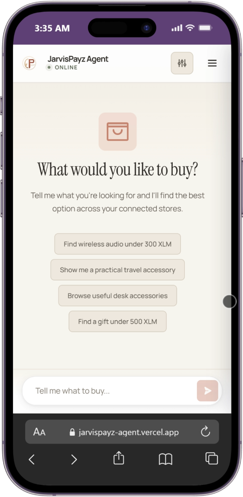 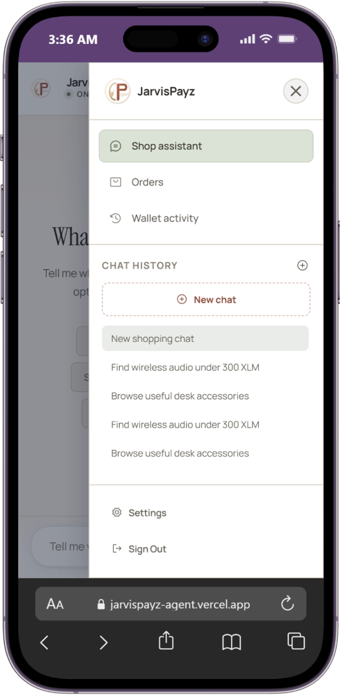 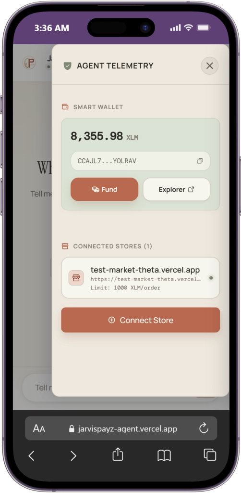 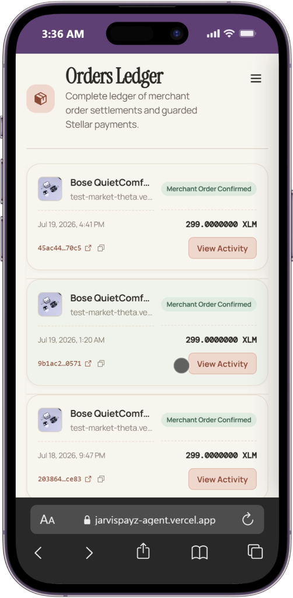 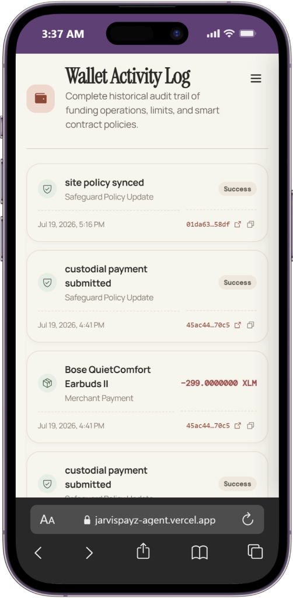 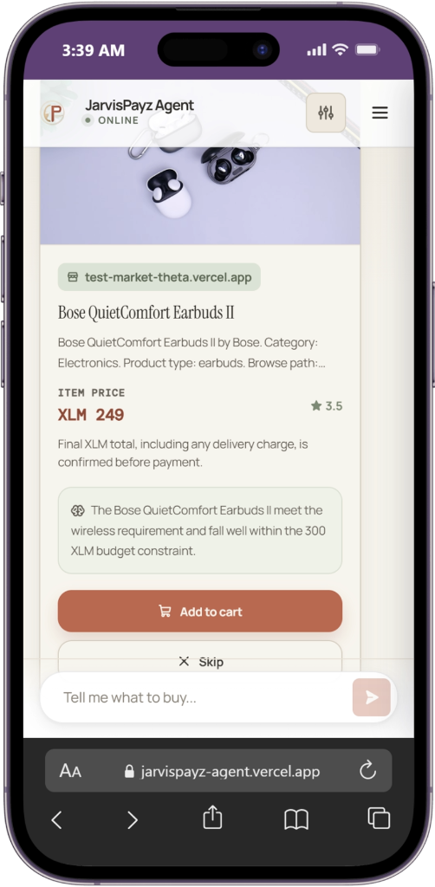 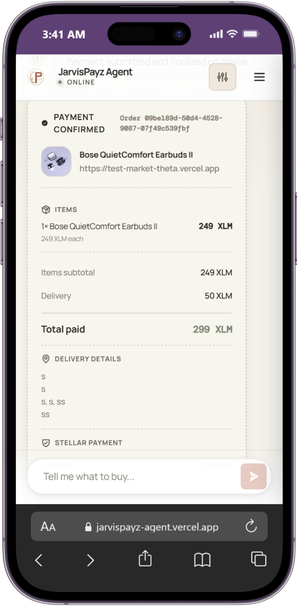

### Analytics and Monitoring

| Tool | Screenshot |
|---|---|
| Sentry Error Dashboard |  |
| PostHog Activity Explorer | 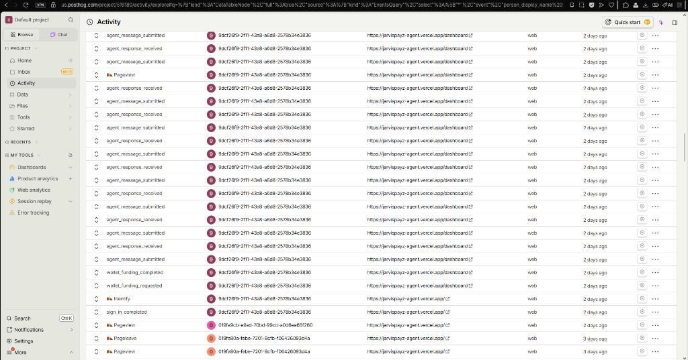 |
| PostHog Web Analytics Dashboard | 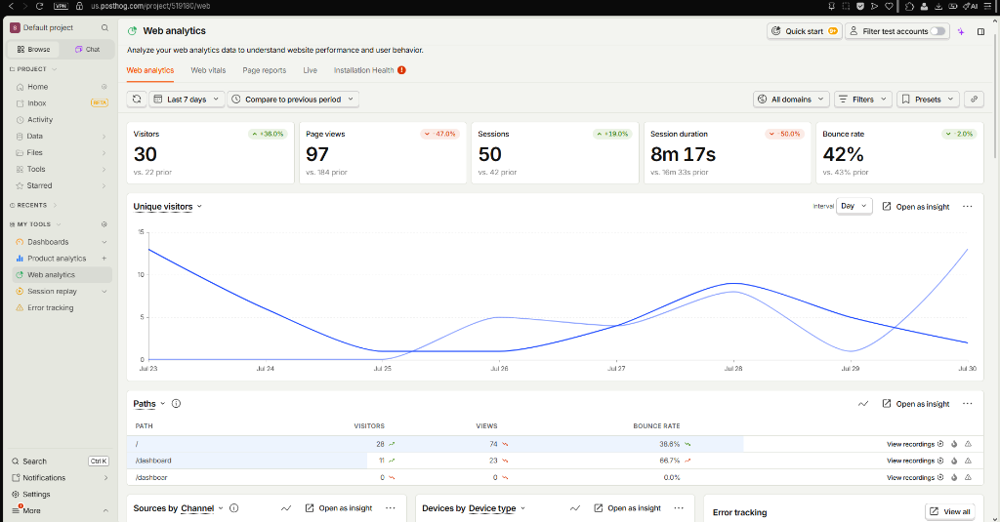 |

---

## Demo Video

**Demo video:** [https://youtu.be/3_hogOvz71U](https://youtu.be/3_hogOvz71U)

The demo covers: Google sign-in, wallet restore/funding, store OAuth connection to [TestMarket](https://test-market-theta.vercel.app), natural-language search, basket/quantity changes, checkout approval with exact merchant total, on-chain payment, and Stellar Explorer receipt.

---

## User Feedback Summary

Most users found the site and the agent a bit slow, and that's a real issue. I've identified the cause and will fix it in the next update.

---

## Team Review Summary

### Technical Complexity
JarvisPayz integrates a dual-signer model (custodial owner key and constrained agent key) encrypted at rest using AES-256-GCM. Outbound transfers are audited on-chain via per-user `AgentWallet` smart contracts that validate budgets, per-transaction limits, and merchant trust against a policy registry. A background reconciliation engine polls finality to confirm orders durably without duplicating payments, and the store discovery lifecycle uses OAuth 2.0 with PKCE (S256).

### Product Quality
The application removes standard Web3 friction by allowing users to sign in with Google OAuth to retrieve their persistent custodial wallet, bypassing private keys or browser extensions. Shopping queries are parsed by Gemini and presented as comparison cards where baskets are managed dynamically. The responsive interface is optimized for both desktop and mobile screens, featuring loading indicators and interactive drawers for approvals.

### Architecture Quality
The system uses a clean Three-Plane separation (Experience, Merchant, and Settlement planes), making the architecture highly modular and portable for future blockchain migrations. Gemini is constrained to intent parsing, while payments and checkout validation are fully deterministic. Observability is integrated via Sentry and PostHog, featuring automated telemetry scrubbers to keep chat logs and key material private.

### Real-World Usefulness
This project bridges Web2 and Web3 by allowing non-technical shoppers to utilize decentralized networks for ecommerce. By placing smart contract policy enforcement directly between the AI agent and the wallet balance, it creates a safe framework for agentic commerce where the AI can suggest basket additions but can never execute payments without explicit user approval.

---

## Technology Stack

| Layer | Technologies |
|---|---|
| **Frontend** | React 19, Vite 8, React Router 7, Stellar SDK 16, Stellar Wallets Kit, Google OAuth, Phosphor Icons |
| **Backend** | Node.js 22, Express 5, Stellar SDK 16, Google Generative AI (Gemini), PostgreSQL (Supabase), JWT, Helmet |
| **Smart Contracts** | Rust, Soroban SDK 25.0.1 |
| **Infrastructure** | Vercel (frontend), Railway (API), Supabase (database), Stellar Testnet (settlement) |
| **Observability** | Sentry (error tracking), PostHog (aggregate analytics) |

---

## Getting Started

### Setup

```bash
git clone <repository-url>
cd agent

# Configure environment variables
cp server/.env.example server/.env    # Edit with your credentials
cp client/.env.example client/.env    # Edit with your public config

# Database setup
npx supabase db push

# Smart contracts
cargo build --workspace --release

# Start development servers
cd server && npm install && npm run dev    # Terminal 1
cd client && npm install && npm run dev    # Terminal 2
```

---

## License

Copyright © 2026 JarvisPayz. All rights reserved. Proprietary.
