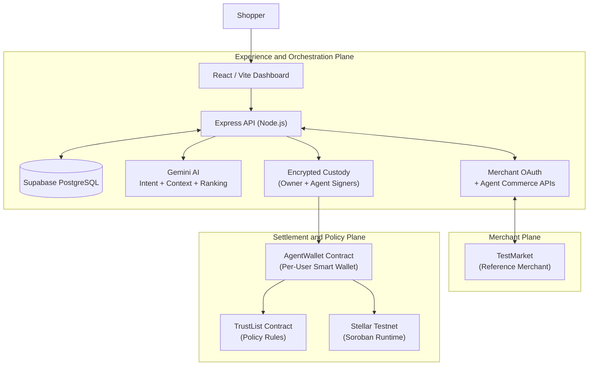
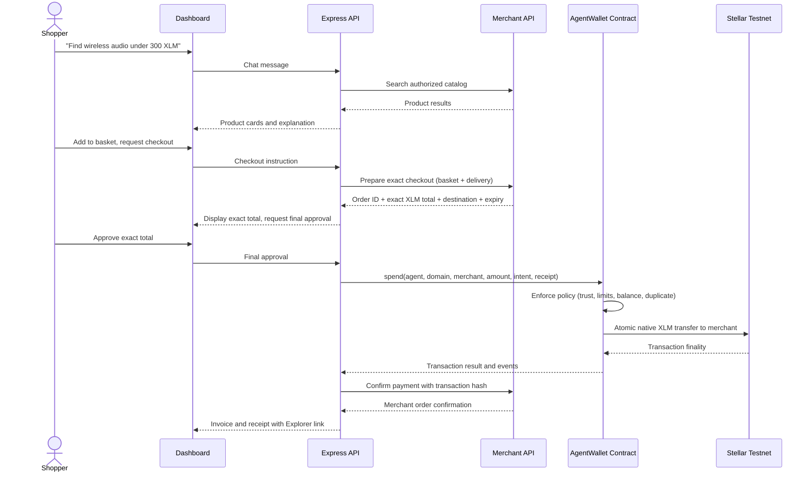
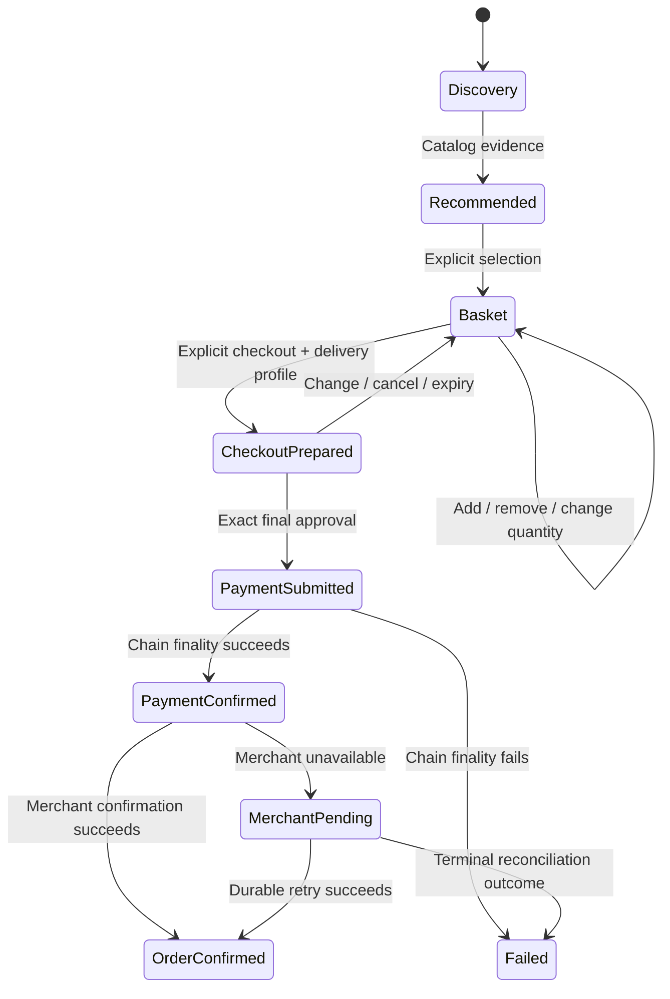

# JarvisPayz Agent

**An AI-powered managed-wallet shopping agent on the Stellar network.**

JarvisPayz allows users to sign in, receive a persistent custodial smart wallet, connect authorized ecommerce stores via OAuth, and use natural-language chat to discover, compare, and purchase products -- all settled in test XLM on Stellar testnet through on-chain policy enforcement.

| | |
|---|---|
| **Live Demo** | [jarvispayz-agent.vercel.app](https://jarvispayz-agent.vercel.app) |
| **Test Merchant** | [test-market-theta.vercel.app](https://test-market-theta.vercel.app) |
| **Network** | Stellar Testnet (Soroban) |
| **Settlement Asset** | Native XLM (test) |
| **Status** | Testnet demonstration |

---

## Table of Contents

- [Project Overview](#project-overview)
- [Architecture](#architecture)
- [Smart Contracts](#smart-contracts)
- [Technology Stack](#technology-stack)
- [Core Features](#core-features)
- [Security Model](#security-model)
- [Getting Started](#getting-started)
- [Contract Addresses](#contract-addresses)
- [User Wallet Interactions](#user-wallet-interactions)
- [Screenshots](#screenshots)
- [Demo Video](#demo-video)
- [User Feedback Summary](#user-feedback-summary)
- [License](#license)

---

## Project Overview

Traditional ecommerce requires separate account sign-ins, browser wallet extensions, manual product discovery, and repeated checkout friction. An autonomous shopping agent that can browse arbitrary stores or move funds without explicit user approval introduces unacceptable risk.

JarvisPayz solves both problems:

1. **Frictionless managed wallet** -- a single identity restores the same smart wallet and balance across sessions. No browser extensions, no seed phrases.
2. **Natural-language shopping** -- users describe what they need; the agent searches only authorized merchant catalogs, recommends relevant products, and builds a basket.
3. **Exact-amount approval** -- the merchant-verified total is shown before any payment. The user must explicitly approve the specific prepared order.
4. **On-chain policy enforcement** -- every payment passes through the AgentWallet smart contract, which atomically validates merchant trust, per-transaction limits, daily spending caps, duplicate-intent protection, and available balance before transferring XLM directly to the merchant.

> This is a testnet demonstration. Every amount is test XLM. Do not use for real-money transactions.

---

## Architecture



### Three-Plane Design

**1. Experience and Orchestration Plane** -- The React dashboard and Express API handle identity (Google OAuth / Stellar wallet sign-in), chat session management, AI-driven product search and ranking, merchant OAuth connection lifecycle, basket state, checkout preparation, invoice encryption, and purchase reconciliation.

**2. Merchant Plane** -- Independently deployed ecommerce stores expose OAuth authorization server metadata, agent-commerce metadata, and scoped APIs for catalog search, checkout preparation, payment confirmation, and order management. [TestMarket](https://test-market-theta.vercel.app) is the reference merchant used for integration testing. JarvisPayz connects to any compatible merchant through URL discovery and standard OAuth -- there is no hard-coded merchant integration.

**3. Settlement and Policy Plane** -- Per-user Soroban smart wallets hold spendable XLM. The AgentWallet contract enforces every spend against the TrustList policy contract before executing an atomic direct transfer to the merchant. No escrow, no intermediary.

### End-to-End Payment Flow



### Commerce State Machine



Each state transition is gated by explicit user action. The agent cannot advance from search to payment without the user's checkout instruction and final approval of the exact merchant-quoted amount.

---

## Smart Contracts

All contracts are written in Rust targeting the Soroban runtime (Stellar's smart contract platform). The workspace uses `soroban-sdk 25.0.1`.

### AgentWallet (`contracts/agent-wallet`)

A per-user programmable wallet that holds spendable XLM and enforces policy on every outbound transfer.

**Public interface:**

| Function | Purpose |
|---|---|
| `__constructor(owner, agent, token, trust_list)` | Deploy with owner authority, constrained agent signer, token address, and TrustList reference. |
| `fund(owner, amount)` | Move XLM from the custodial funding account into the smart wallet. Owner-authorized only. |
| `spend(agent, domain_hash, merchant, amount, intent_hash, receipt_hash)` | Execute a policy-guarded direct transfer. Requires both owner and agent authorization. |
| `withdraw(owner, recipient, amount)` | Owner-only fund recovery to any recipient address. |
| `set_agent(owner, agent)` | Rotate the constrained agent signer. Owner-authorized only. |
| `balance()` | Query current smart wallet balance. |

**Policy enforcement within `spend`:**

1. Verify owner and agent authorization (dual-signature).
2. Confirm agent matches the configured constrained signer.
3. Check `intent_hash` has not been used (duplicate-intent protection).
4. Query TrustList for `(owner, domain_hash)` rule.
5. Verify merchant address matches the rule and the rule is enabled.
6. Validate amount against `per_transaction_limit`.
7. Validate `spent_today + amount` against `daily_limit`.
8. Confirm sufficient balance.
9. Execute atomic native XLM transfer to merchant.
10. Record daily spend and mark intent as used.
11. Emit `WalletPurchaseEvent` with receipt hash.

**Error codes:**

| Code | Meaning |
|---|---|
| `AlreadyInitialized (1)` | Wallet was already deployed. |
| `NotInitialized (2)` | Wallet has not been deployed. |
| `Unauthorized (3)` | Caller is not the owner or agent does not match. |
| `InvalidAmount (4)` | Amount is zero or negative. |
| `InsufficientBalance (5)` | Wallet balance is below the requested amount. |
| `MerchantNotTrusted (6)` | No TrustList rule exists, rule is disabled, or merchant address mismatch. |
| `PerTransactionLimit (7)` | Amount exceeds the per-transaction cap. |
| `DailyLimit (8)` | Cumulative daily spend would exceed the daily cap. |
| `DuplicateIntent (9)` | This intent hash has already been used. |

### TrustList (`contracts/trust-list`)

A policy registry mapping `(owner, domain_hash)` to merchant trust rules.

| Function | Purpose |
|---|---|
| `initialize()` | One-time contract initialization. |
| `set_rule(owner, domain_hash, merchant, daily_limit, per_transaction_limit, category, enabled, version)` | Create or update a merchant trust rule. Owner-authorized. |
| `remove_rule(owner, domain_hash)` | Remove a merchant rule entirely. Owner-authorized. |
| `get_rule(owner, domain_hash)` | Query the current rule for a merchant domain. |

**TrustRule structure:** `{ merchant: Address, daily_limit: i128, per_transaction_limit: i128, category: Symbol, enabled: bool, version: u32 }`

### SpendGuard (`contracts/spend-guard`)

Legacy escrow-based policy contract retained for compatibility and audit history. Not used in the current direct-wallet payment route.

---

## Technology Stack

| Layer | Technologies |
|---|---|
| **Frontend** | React 19, Vite 8, React Router 7, Stellar SDK 16, Stellar Wallets Kit, Google OAuth, Phosphor Icons |
| **Backend** | Node.js 22, Express 5, Stellar SDK 16, Google Generative AI (Gemini), PostgreSQL (Supabase), JWT, Helmet |
| **Smart Contracts** | Rust, Soroban SDK 25.0.1 |
| **Infrastructure** | Vercel (frontend), Railway (API), Supabase (database), Stellar Testnet (settlement) |
| **Observability** | Sentry (error tracking, optional), PostHog (aggregate analytics, optional) |

---

## Core Features

### Identity and Managed Wallet

- **Google sign-in** as the primary identity provider. Stellar wallet sign-in supported as an alternative.
- First login creates one user record and exactly one set of custody accounts: owner signer, constrained agent signer, and Agent Smart Wallet (`C...` address).
- Repeat login restores the existing wallet and balance -- no replacement, no reset.
- Friendbot integration for testnet funding.

### Store Connection via OAuth

- User provides a merchant HTTPS URL (e.g., [test-market-theta.vercel.app](https://test-market-theta.vercel.app)) and daily XLM cap.
- JarvisPayz discovers `/.well-known/oauth-authorization-server` and `/.well-known/agent-commerce` metadata.
- Standard Authorization Code flow with PKCE (S256). Dynamic client registration when required.
- Encrypted token storage. Merchant policy rules synchronized to the TrustList contract on connection.
- Manual disconnect revokes tokens and deactivates policy access.

### Natural-Language Shopping

- AI-powered intent parsing using Google Gemini for structured shopping intent extraction.
- Constrained to authorized merchant catalogs only -- no arbitrary web scraping.
- Semantic product search with controlled query expansion, ranking, and safe fallback browsing.
- Durable conversation memory persisted in PostgreSQL for multi-turn shopping context.

### Basket, Checkout, and Payment

- Multi-item basket with quantity management.
- Checkout requires explicit user instruction after basket completion.
- Merchant-side checkout preparation returns the exact XLM total, shipping, order ID, and payment destination.
- Dual-authorization (owner + constrained agent) for every `spend` call.
- Atomic policy enforcement: merchant trust, amount limits, daily caps, duplicate intent, and balance checks.
- Direct wallet-to-merchant XLM transfer. No escrow, no intermediary.
- Encrypted invoice snapshot stored separately from chat metadata.
- Durable reconciliation: merchant confirmation failures after chain settlement are retried without resubmitting the chain transaction.

---

## Security Model

This is a **custodial** system by design. The backend holds encrypted signing material for both the owner and constrained agent accounts.

| Identity | Purpose |
|---|---|
| Custodial Owner Account (`G...`) | Owner authorization, Friendbot funding, smart wallet deployment and recovery. |
| Constrained Agent Signer (`G...`) | Co-signs smart wallet spend calls. Cannot independently transfer funds. |
| Agent Smart Wallet (`C...`) | User-visible programmable wallet holding spendable XLM. |

- Private keys encrypted at rest using AES-256-GCM with separate scoped derivations.
- Merchant OAuth tokens encrypted at rest.
- Delivery profile and invoice snapshots encrypted at rest.

---

## Getting Started

### Prerequisites

- Node.js 22+
- Rust toolchain with `soroban-cli`
- Supabase project (PostgreSQL)
- Google Cloud Console project (OAuth Client ID)
- Gemini API key

### Setup

```bash
git clone <repository-url>
cd agent

# Configure environment variables
cp server/.env.example server/.env    # Edit with your credentials
cp client/.env.example client/.env    # Edit with your public config

# Database
npx supabase db push

# Smart contracts
cargo build --workspace --release
cargo test --workspace

# Start development servers
cd server && npm install && npm run dev    # Terminal 1
cd client && npm install && npm run dev    # Terminal 2
```

See `server/.env.example` and `client/.env.example` for the full list of required configuration variables.

---

## Contract Addresses

> Deployed on Stellar Testnet (Soroban).

| Contract | Address |
|---|---|
| TrustList (Policy) | [`CCF7TJNLJUFTQYQSJH3BUBF6E6DPWGG4T6LIH5PVET4TJKOMNIHDEZKK`](https://stellar.expert/explorer/testnet/contract/CCF7TJNLJUFTQYQSJH3BUBF6E6DPWGG4T6LIH5PVET4TJKOMNIHDEZKK) |
| SpendGuard (Legacy Policy) | [`CCM46FWI7N43QETVUQUS5QPIGCOEKIF4IKHEO2XNPIQGMMJC2FAARNMO`](https://stellar.expert/explorer/testnet/contract/CCM46FWI7N43QETVUQUS5QPIGCOEKIF4IKHEO2XNPIQGMMJC2FAARNMO) |
| Native XLM Stellar Asset Contract | [`CDLZFC3SYJYDZT7K67VZ75HPJVIEUVNIXF47ZG2FB2RMQQVU2HHGCYSC`](https://stellar.expert/explorer/testnet/contract/CDLZFC3SYJYDZT7K67VZ75HPJVIEUVNIXF47ZG2FB2RMQQVU2HHGCYSC) |
| AgentWallet WASM | `892f964953c5bb9fa2ebfe41b42e05f9f78c145fd6fc4482fc134ec4542d979b` |

---

## User Wallet Interactions

Proof of 10+ user wallet interactions on the Stellar testnet. Each hash links to the corresponding transaction on Stellar Expert.

| Sl No. | Login Method | Agent's Wallet Address | Tx Hash |
| :---: | :---: | :--- | :--- |
| 1 | Google | [`CDFACHLS...`](https://stellar.expert/explorer/testnet/contract/CDFACHLSKLZI6SZYHPTBCXAKH2VH6CCP73OVVA4IDERITH7ATQ5EFMLH) | [`56b910e3d...`](https://stellar.expert/explorer/testnet/tx/56b910e3d09334f9ec118653d8413834524de0b99bd020a8b23a605b31cba6fa) |
| 2 | Google | [`CBTXDCNJ...`](https://stellar.expert/explorer/testnet/contract/CBTXDCNJ47LG32YREVKXFXGE55IWBYHZ5UNI5DX7WVAMD5J65GCZLAJQ) | [`d48ae8b9e...`](https://stellar.expert/explorer/testnet/tx/d48ae8b9ec8abaef511c6b7b6739f4ac22f3765422910a5ac066e07b7738b19a) |
| 3 | Google | [`CAVXKUZN...`](https://stellar.expert/explorer/testnet/contract/CAVXKUZNBDWMEEKEFNNRUVZOY2V5J2TIMJQ7UTJPQDE35JJ3SKDYNY6Q) | [`9bd81a18f...`](https://stellar.expert/explorer/testnet/tx/9bd81a18f88c08fac800747829c5fa7b3dcad5a6daf8b78e186eb9e072a3cb83) |
| 4 | Wallet | [`CDAXFCA5...`](https://stellar.expert/explorer/testnet/contract/CDAXFCA5ZHIXJ3UQIRLMDD7M42Y3WMJWJEJMROYMD3JFCXQJNWJKITER) | [`bd3c53b72...`](https://stellar.expert/explorer/testnet/tx/bd3c53b728c86c4c9ae5dae4deb90f8bbf901ab0ad64d5b5e0d664164d172088) |
| 5 | Google | [`CAB2T3KC...`](https://stellar.expert/explorer/testnet/contract/CAB2T3KC7RFO2ARVRGX5QM7X6COOKJILDM3EJWVF24GGZWUFUPPBROUE) | [`c1c1686dc...`](https://stellar.expert/explorer/testnet/tx/c1c1686dc0eb647f490b355fb628635e13eeb17addde19e5b478ade932022bdf) |
| 6 | Google | [`CB4RTF3H...`](https://stellar.expert/explorer/testnet/contract/CB4RTF3HZ3UPYYJX5X7ILGQYJXU3Y67VCWOMGCKAASJUCU233TFVEE4Z) | [`325e46a06...`](https://stellar.expert/explorer/testnet/tx/325e46a069275d5c15933731960615387ee50e8192931c7a26255200976d2fe2) |
| 7 | Google | [`CDJKMCOJ...`](https://stellar.expert/explorer/testnet/contract/CDJKMCOJAIRA5REUYG575DP2DV5NSCYI7QAU4DUW6VIBOMWCKKVWE3FF) | [`910032bfb...`](https://stellar.expert/explorer/testnet/tx/910032bfb9a94f11410d823acc110b4ab1a218cadc3e1ebf0fe324e956f6723f) |
| 8 | Google | [`CCAJL7SJ...`](https://stellar.expert/explorer/testnet/contract/CCAJL7SJDHC4SOCZO7DSIOZRTWBTDGSFBNJQL4OAGP7CQTDGOQYOLRAV) | [`45ac44ba9...`](https://stellar.expert/explorer/testnet/tx/45ac44ba9a6219e318f9ab928a718e33a778b127c72c979106766d6b527e70c5) |
| 9 | Wallet | [`CCSMAFS6...`](https://stellar.expert/explorer/testnet/contract/CCSMAFS6QE3C6J6D6EGKBFPK6ZMCD7ZSKXSHWDHKO635BWSCQHFVUZAR) | [`d3b81969a...`](https://stellar.expert/explorer/testnet/tx/d3b81969affd63b915dbebc799df0eff0e958adef34610bef4f66d070bc5a2a5) |
| 10 | Wallet | [`CDVVJSHB...`](https://stellar.expert/explorer/testnet/contract/CDVVJSHBF2C2ZBFTO2HN5J7AFTGLEMPRN2E6ZLLLGZC4RAY774XAZ52S) | [`191f4fd1c...`](https://stellar.expert/explorer/testnet/tx/191f4fd1cb043458ec3f113438bdb0ec023722f80fc2b8e73c3f4e823ed9897d) |

---

## Screenshots

### Product UI -- Desktop


### Mobile Responsive Design


### Analytics and Monitoring

| Tool | Screenshot |
|---|---|
| Sentry Error Dashboard |  |
| PostHog Activity Explorer |  |
| PostHog Web Analytics Dashboard |  |

---

## Demo Video

**Demo video:** [https://youtu.be/3_hogOvz71U](https://youtu.be/3_hogOvz71U)

The demo covers: Google sign-in, wallet restore/funding, store OAuth connection to [TestMarket](https://test-market-theta.vercel.app), natural-language search, basket/quantity changes, checkout approval with exact merchant total, on-chain payment, and Stellar Explorer receipt.

---

## User Feedback Summary

Most users found the site and the agent a bit slow, and that's a real issue. I've identified the cause and will fix it in the next update.

---

## License

Copyright © 2026 JarvisPayz. All rights reserved. Proprietary.
