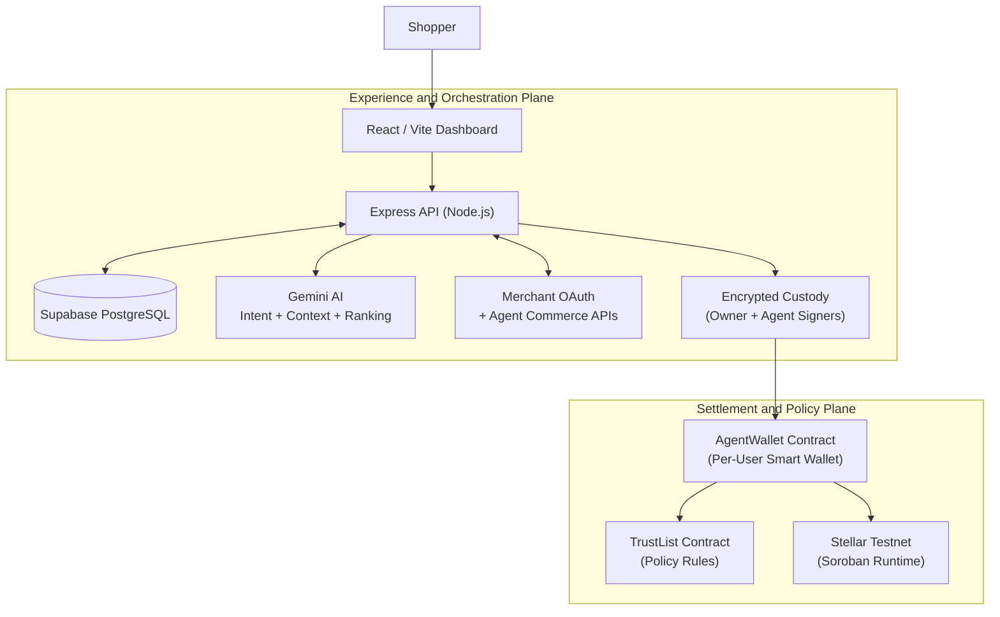
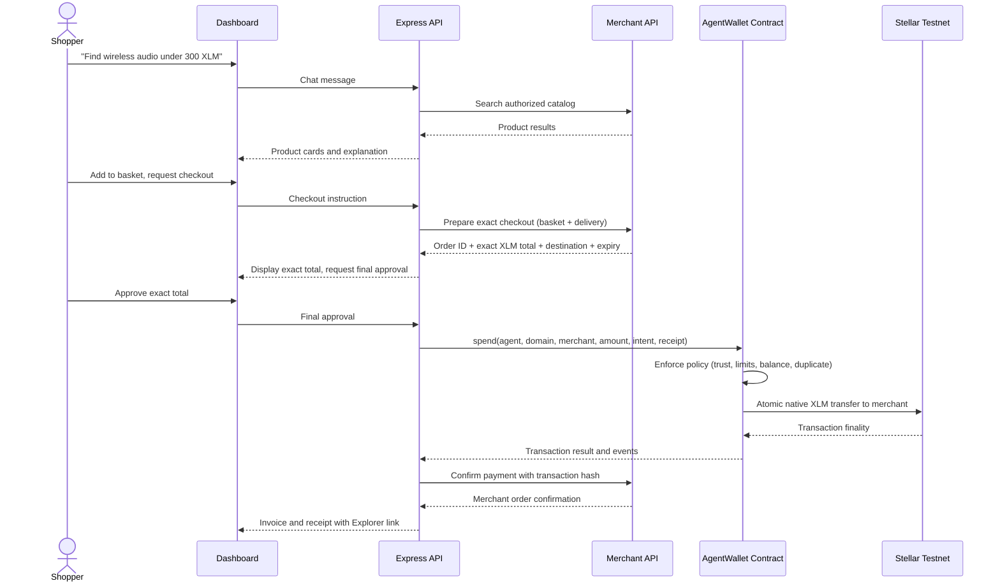
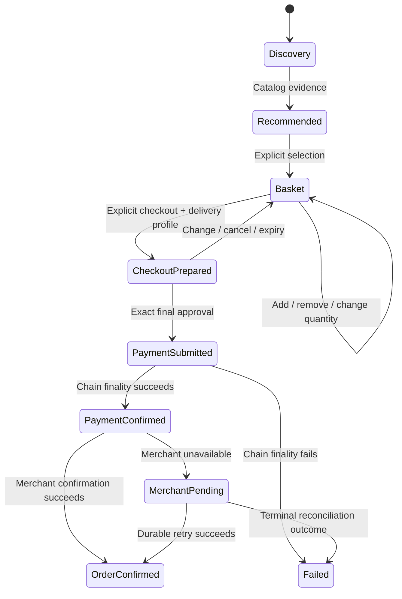

# JarvisPayz Agent

**An AI-powered managed-wallet shopping agent on the Stellar network.**

JarvisPayz allows users to sign in, receive a persistent custodial smart wallet, connect authorized ecommerce stores via OAuth, and use natural-language chat to discover, compare, and purchase products -- all settled in test XLM on Stellar testnet through on-chain policy enforcement.

| | |
|---|---|
| **Live Demo** | [jarvispayz-agent.vercel.app](https://jarvispayz-agent.vercel.app) |
| **Network** | Stellar Testnet (Soroban) |
| **Settlement Asset** | Native XLM (test) |
| **Status** | Testnet demonstration |

---

## Table of Contents

- [Project Overview](#project-overview)
- [Architecture](#architecture)
- [Smart Contracts](#smart-contracts)
- [Technology Stack](#technology-stack)
- [Repository Structure](#repository-structure)
- [Core Features](#core-features)
- [Security Model](#security-model)
- [API Surface](#api-surface)
- [Getting Started](#getting-started)
- [Deployment](#deployment)
- [Observability](#observability)
- [Contract Addresses](#contract-addresses)
- [User Wallet Interactions](#user-wallet-interactions)
- [Screenshots](#screenshots)
- [Demo Video](#demo-video)
- [User Feedback Summary](#user-feedback-summary)
- [License](#license)

---

## Project Overview

Traditional ecommerce requires separate account sign-ins, browser wallet extensions, manual product discovery, and repeated checkout friction. An autonomous shopping agent that can browse arbitrary stores or move funds without explicit user approval introduces unacceptable risk.

JarvisPayz solves both problems:

1. **Frictionless managed wallet** -- a single identity restores the same smart wallet and balance across sessions. No browser extensions, no seed phrases.
2. **Natural-language shopping** -- users describe what they need; the agent searches only authorized merchant catalogs, recommends relevant products, and builds a basket.
3. **Exact-amount approval** -- the merchant-verified total is shown before any payment. The user must explicitly approve the specific prepared order.
4. **On-chain policy enforcement** -- every payment passes through the AgentWallet smart contract, which atomically validates merchant trust, per-transaction limits, daily spending caps, duplicate-intent protection, and available balance before transferring XLM directly to the merchant.

> This is a testnet demonstration. Every amount is test XLM. Do not use for real-money transactions.

---

## Architecture



### Three-Plane Design

The system is organized into three distinct trust boundaries:

**1. Experience and Orchestration Plane**

The React dashboard and Express API handle identity (Google OAuth / Stellar wallet sign-in), chat session management, AI-driven product search and ranking, merchant OAuth connection lifecycle, basket state, checkout preparation, invoice encryption, and purchase reconciliation.

**2. Merchant Plane**

Independently deployed ecommerce stores expose OAuth authorization server metadata, agent-commerce metadata, and scoped APIs for catalog search, checkout preparation, payment confirmation, and order management. JarvisPayz connects to any compatible merchant through URL discovery and standard OAuth -- there is no hard-coded merchant integration.

**3. Settlement and Policy Plane**

Per-user Soroban smart wallets hold spendable XLM. The AgentWallet contract enforces every spend against the TrustList policy contract before executing an atomic direct transfer to the merchant. No escrow, no intermediary.

### End-to-End Payment Flow



### Commerce State Machine



Each state transition is gated by explicit user action. The agent cannot advance from search to payment without the user's checkout instruction and final approval of the exact merchant-quoted amount.

---

## Smart Contracts

All contracts are written in Rust targeting the Soroban runtime (Stellar's smart contract platform). The workspace uses `soroban-sdk 25.0.1`.

### AgentWallet (`contracts/agent-wallet`)

A per-user programmable wallet that holds spendable XLM and enforces policy on every outbound transfer.

**Public interface:**

| Function | Purpose |
|---|---|
| `__constructor(owner, agent, token, trust_list)` | Deploy with owner authority, constrained agent signer, token address, and TrustList reference. |
| `fund(owner, amount)` | Move XLM from the custodial funding account into the smart wallet. Owner-authorized only. |
| `spend(agent, domain_hash, merchant, amount, intent_hash, receipt_hash)` | Execute a policy-guarded direct transfer. Requires both owner and agent authorization. |
| `withdraw(owner, recipient, amount)` | Owner-only fund recovery to any recipient address. |
| `set_agent(owner, agent)` | Rotate the constrained agent signer. Owner-authorized only. |
| `balance()` | Query current smart wallet balance. |

**Policy enforcement within `spend`:**

1. Verify owner and agent authorization (dual-signature).
2. Confirm agent matches the configured constrained signer.
3. Check `intent_hash` has not been used (duplicate-intent protection).
4. Query TrustList for `(owner, domain_hash)` rule.
5. Verify merchant address matches the rule and the rule is enabled.
6. Validate amount against `per_transaction_limit`.
7. Validate `spent_today + amount` against `daily_limit`.
8. Confirm sufficient balance.
9. Execute atomic native XLM transfer to merchant.
10. Record daily spend and mark intent as used.
11. Emit `WalletPurchaseEvent` with receipt hash.

**Error codes:**

| Code | Meaning |
|---|---|
| `AlreadyInitialized (1)` | Wallet was already deployed. |
| `NotInitialized (2)` | Wallet has not been deployed. |
| `Unauthorized (3)` | Caller is not the owner or agent does not match. |
| `InvalidAmount (4)` | Amount is zero or negative. |
| `InsufficientBalance (5)` | Wallet balance is below the requested amount. |
| `MerchantNotTrusted (6)` | No TrustList rule exists, rule is disabled, or merchant address mismatch. |
| `PerTransactionLimit (7)` | Amount exceeds the per-transaction cap. |
| `DailyLimit (8)` | Cumulative daily spend would exceed the daily cap. |
| `DuplicateIntent (9)` | This intent hash has already been used. |

### TrustList (`contracts/trust-list`)

A policy registry mapping `(owner, domain_hash)` to merchant trust rules.

**Public interface:**

| Function | Purpose |
|---|---|
| `initialize()` | One-time contract initialization. |
| `set_rule(owner, domain_hash, merchant, daily_limit, per_transaction_limit, category, enabled, version)` | Create or update a merchant trust rule. Owner-authorized. |
| `remove_rule(owner, domain_hash)` | Remove a merchant rule entirely. Owner-authorized. |
| `get_rule(owner, domain_hash)` | Query the current rule for a merchant domain. |

**TrustRule structure:** `{ merchant: Address, daily_limit: i128, per_transaction_limit: i128, category: Symbol, enabled: bool, version: u32 }`

### PolicyInterface (`contracts/policy-interface`)

Shared Soroban types and client interfaces consumed by both AgentWallet and TrustList.

### SpendGuard (`contracts/spend-guard`)

Legacy escrow-based policy contract retained for compatibility and audit history. Not used in the current direct-wallet payment route.

---

## Technology Stack

### Frontend

| Technology | Version | Purpose |
|---|---|---|
| React | 19.x | UI framework |
| Vite | 8.x | Build toolchain and dev server |
| React Router | 7.x | Client-side routing |
| Stellar SDK | 16.x | Stellar network interaction |
| Stellar Wallets Kit | 1.x | Browser wallet sign-in (identity only) |
| Google OAuth | 0.13.x | Primary authentication |
| Axios | 1.x | HTTP client |
| Phosphor Icons | 2.x | Icon system |
| Sentry React | 10.x | Error monitoring (optional) |
| PostHog | 1.x | Product analytics (optional) |

### Backend

| Technology | Version | Purpose |
|---|---|---|
| Node.js | 22 (Alpine) | Runtime |
| Express | 5.x | HTTP framework |
| Stellar SDK | 16.x | Soroban RPC and Horizon integration |
| Google Generative AI | 0.24.x | Gemini-powered intent parsing and product ranking |
| PostgreSQL (Supabase) | -- | Persistent state, encrypted secrets, chat memory |
| JSON Web Tokens | 9.x | Session authentication |
| Helmet | 8.x | Security headers |
| google-auth-library | 10.x | Server-side Google credential verification |

### Smart Contracts

| Technology | Version | Purpose |
|---|---|---|
| Rust | stable | Contract language |
| Soroban SDK | 25.0.1 | Stellar smart contract framework |
| Soroban Runtime | -- | On-chain execution environment |

### Infrastructure

| Service | Purpose |
|---|---|
| Vercel | Frontend hosting (static SPA deployment) |
| Railway | Backend API hosting (Dockerized Node.js) |
| Supabase | Managed PostgreSQL with connection pooling |
| Stellar Testnet | Blockchain settlement and policy enforcement |

---

## Repository Structure

```
agent/
|-- client/                         # Frontend (React + Vite)
|   |-- src/
|   |   |-- components/
|   |   |   |-- chat/               # ChatWindow, MessageBubble, ProductCard, ReceiptCard
|   |   |   |-- common/             # ErrorBoundary, StellarWalletLoginButton
|   |   |   |-- layout/             # AppLayout (sidebar + main content)
|   |   |   |-- settings/           # ConnectSiteModal, SettingsPanel, SiteCard, StoreDetailsModal
|   |   |   |-- Hero.jsx            # Landing page hero
|   |   |   |-- Features.jsx        # Feature showcase
|   |   |   |-- WalletCard.jsx      # Wallet balance and activity display
|   |   |   +-- ...
|   |   |-- contexts/               # AuthContext, ToastContext
|   |   |-- pages/                  # Landing, Dashboard, NotFound
|   |   |-- services/               # API client layer
|   |   +-- styles/                 # CSS stylesheets
|   |-- index.html
|   |-- vite.config.js
|   +-- vercel.json
|
|-- server/                         # Backend (Express API)
|   |-- src/
|   |   |-- config/                 # Environment configuration
|   |   |-- db/                     # Supabase PostgreSQL connection
|   |   |-- middleware/             # JWT auth, rate limiting
|   |   |-- routes/                 # auth, wallet, chat, sites, purchases, profile
|   |   |-- services/
|   |   |   |-- agent.service.js            # Orchestration engine and conversation state machine
|   |   |   |-- auth.service.js             # Google/Stellar identity verification
|   |   |   |-- payment.service.js          # Settlement submission and reconciliation
|   |   |   |-- wallet.service.js           # Managed wallet lifecycle and encryption
|   |   |   |-- soroban.service.js          # Soroban RPC interactions
|   |   |   |-- site-oauth.service.js       # Merchant OAuth (PKCE, discovery, token management)
|   |   |   |-- intent.service.js           # Natural-language intent parsing (Gemini)
|   |   |   |-- product.service.js          # Product search and ranking
|   |   |   |-- crypto.service.js           # AES-256-GCM encryption primitives
|   |   |   |-- conversation-memory.service.js  # Durable chat context
|   |   |   |-- observability.service.js    # Sentry and PostHog integration
|   |   |   +-- ...
|   |   +-- index.js                # Server entry point
|   +-- Dockerfile
|
|-- contracts/                      # Soroban smart contracts (Rust)
|   |-- agent-wallet/               # Per-user programmable wallet
|   |-- trust-list/                 # Merchant policy registry
|   |-- spend-guard/                # Legacy escrow contract (historical)
|   +-- policy-interface/           # Shared types and client interface
|
|-- supabase/
|   +-- migrations/                 # 16 sequential PostgreSQL migrations
|
|-- docs/
|   |-- DEPLOYMENT.md               # Deployment guide
|   |-- PRIVACY.md                  # Privacy policy and data handling
|   |-- TESTING.md                  # Testing procedures
|   +-- evidence/                   # Submission evidence assets
|
|-- Cargo.toml                      # Rust workspace root
|-- Dockerfile                      # Railway deployment (server)
|-- railway.toml                    # Railway configuration
+-- PRD.md                          # Product Requirements Document
```

---

## Core Features

### Identity and Managed Wallet

- **Google sign-in** as the primary identity provider. Stellar wallet sign-in is supported as an alternative identity method.
- First login creates a user record and exactly one set of custody accounts: owner signer, constrained agent signer, and Agent Smart Wallet (`C...` address).
- Repeat login restores the existing wallet and balance -- no replacement, no reset.
- Friendbot integration for testnet funding. Funds flow from Friendbot to the custodial owner account, then into the smart wallet.

### Store Connection via OAuth

- User provides a merchant HTTPS URL and daily XLM cap.
- JarvisPayz discovers `/.well-known/oauth-authorization-server` and `/.well-known/agent-commerce` metadata.
- Standard Authorization Code flow with PKCE (S256). Dynamic client registration when required.
- Encrypted token storage. Merchant policy rules synchronized to the TrustList contract on connection.
- Manual disconnect revokes tokens and deactivates policy access.

### Natural-Language Shopping

- AI-powered intent parsing using Google Gemini for structured shopping intent extraction.
- Constrained to authorized merchant catalogs only -- no arbitrary web scraping.
- Semantic product search with controlled query expansion, ranking, and safe fallback browsing.
- Follow-up scoping: "which has the best review?" ranks the currently shown candidates, not the entire catalog.
- Durable conversation memory persisted in PostgreSQL for multi-turn shopping context.

### Basket and Checkout

- Multi-item basket with quantity management.
- Checkout requires explicit user instruction after basket completion.
- Merchant-side checkout preparation returns the exact XLM total, shipping, order ID, and payment destination.
- Destination verification against the trusted merchant address from the TrustList.
- Time-limited quotes with expiry enforcement.

### On-Chain Payment

- Dual-authorization (owner + constrained agent) for every `spend` call.
- Atomic policy enforcement: merchant trust, amount limits, daily caps, duplicate intent, and balance checks.
- Direct wallet-to-merchant XLM transfer. No escrow, no intermediary.
- On-chain `WalletPurchaseEvent` emission with receipt hash.
- Encrypted invoice snapshot stored separately from chat metadata.

### Durable Reconciliation

- Merchant confirmation is separated from chain finality.
- A merchant callback failure after successful chain settlement creates a durable reconciliation job.
- The reconciliation worker retries confirmation with backoff -- it never resubmits the chain transaction.
- Reconciliation jobs survive API restart via PostgreSQL persistence.

---

## Security Model

### Custody Architecture

This is a **custodial** system by design. The backend holds encrypted signing material for both the owner and constrained agent accounts. Do not represent this as self-custody.

| Identity | Purpose |
|---|---|
| Custodial Owner Account (`G...`) | Owner authorization, Friendbot funding, smart wallet deployment and recovery. |
| Constrained Agent Signer (`G...`) | Co-signs smart wallet spend calls. Cannot independently transfer funds. |
| Agent Smart Wallet (`C...`) | User-visible programmable wallet holding spendable XLM. |

### Encryption

- Private keys encrypted at rest using AES-256-GCM with separate scoped derivations (`owner-wallet:<scope>` and `agent-signer:<scope>`).
- Encryption keys derived from `MASTER_SECRET` via the server's crypto service.
- Merchant OAuth tokens encrypted at rest.
- Delivery profile and invoice snapshots encrypted at rest.

### Trust Boundaries

```
  Browser (untrusted)  --->  API (authorization, validation)  --->  Database (encrypted state)
                                       |                |
                                       v                v
                              Merchant (OAuth,      Chain (immutable
                              catalog authority)     policy authority)
```

### Data Classification

| Data | Handling |
|---|---|
| Google credential / wallet signature | Verify once, do not persist raw credential. |
| Session JWT | Browser session storage, server-validated, time-limited. |
| Owner and agent private keys | AES-256-GCM encrypted, separate scoped derivations, never returned to browser or logs. |
| Merchant OAuth tokens | Encrypted at rest, used only for granted store and scopes. |
| Delivery profile / invoice address | Encrypted at rest. Not embedded in chat metadata. |
| Product catalog and prices | Merchant API is source of truth. |
| Spend rules and transfer events | On-chain canonical enforcement and proof. |

---

## API Surface

All protected endpoints require a valid JarvisPayz JWT. Rate limiting distinguishes chat write traffic from dashboard reads.

| Route Group | Purpose |
|---|---|
| `POST /api/auth/google` | Google credential verification and session creation. |
| `POST /api/auth/stellar` | Stellar wallet identity verification. |
| `GET /api/wallet/info` | Retrieve managed wallet address and balance. |
| `POST /api/wallet/fund` | Trigger testnet Friendbot funding. |
| `GET /api/wallet/activity` | Wallet transaction history. |
| `POST /api/chat/bootstrap` | Initialize or restore a chat session. |
| `POST /api/chat/message` | Send a message to the shopping agent. |
| `GET /api/chat/sessions` | List user chat sessions. |
| `POST /api/sites/connect` | Start merchant OAuth discovery and connection. |
| `GET /api/sites/oauth/callback` | OAuth authorization code callback. |
| `DELETE /api/sites/:id` | Disconnect and revoke merchant access. |
| `GET /api/purchases` | Purchase history. |
| `GET /api/purchases/:id/invoice` | Retrieve encrypted invoice for a specific purchase. |
| `GET /api/profile` | Read delivery profile. |
| `PUT /api/profile` | Update delivery profile. |
| `GET /api/health` | Deployment health check. |

---

## Getting Started

### Prerequisites

- Node.js 22+
- Rust toolchain with `soroban-cli`
- Supabase project (PostgreSQL)
- Google Cloud Console project (OAuth Client ID)
- Gemini API key

### 1. Clone the repository

```bash
git clone <repository-url>
cd agent
```

### 2. Configure environment variables

```bash
# Server
cp server/.env.example server/.env
# Edit server/.env with your credentials

# Client
cp client/.env.example client/.env
# Edit client/.env with your public configuration
```

**Server configuration requires:**

| Variable | Description |
|---|---|
| `SUPABASE_DB_URL` | PostgreSQL connection string (transaction pooler). |
| `GOOGLE_CLIENT_ID` | Google OAuth Client ID. |
| `GEMINI_API_KEY` | Google Gemini API key for intent parsing. |
| `JWT_SECRET` | High-entropy secret for session tokens. |
| `MASTER_SECRET` | High-entropy secret for key encryption. |
| `TRUSTLIST_CONTRACT_ID` | Deployed TrustList contract address. |
| `AGENT_WALLET_WASM_HASH` | Deployed AgentWallet WASM hash. |
| `SETTLEMENT_TOKEN_CONTRACT_ID` | Native XLM Stellar Asset Contract ID. |

**Client configuration requires:**

| Variable | Description |
|---|---|
| `VITE_API_URL` | Backend API URL. |
| `VITE_GOOGLE_CLIENT_ID` | Google OAuth Client ID (must match server). |

### 3. Run database migrations

```bash
npx supabase db push
```

### 4. Build smart contracts

```bash
cargo build --workspace --release
cargo test --workspace
```

### 5. Start the development servers

```bash
# Terminal 1 - Backend
cd server
npm install
npm run dev

# Terminal 2 - Frontend
cd client
npm install
npm run dev
```

The frontend runs at `http://localhost:5173` and proxies API requests to `http://localhost:3001`.

### 6. Verification

```bash
# Client
cd client && npm run lint && npm test && npm run build

# Server
cd server && npm test

# Contracts
cargo test --workspace
```

---

## Deployment

### Frontend (Vercel)

- Static SPA deployment with `vercel.json` rewrite rules.
- All routes rewrite to `/index.html` for client-side routing.
- API requests proxy to the Railway-hosted backend.

### Backend (Railway)

- Dockerized Node.js 22 Alpine deployment.
- Health check at `/api/health` with 180-second timeout.
- Restart policy: on failure, maximum 10 retries.
- Environment variables configured via Railway dashboard.

### Database (Supabase)

- Managed PostgreSQL with connection pooling.
- 16 sequential migration files covering the full schema.
- Row-level security oriented data model.

---

## Observability

Both integrations are optional and privacy-safe.

| Tool | Purpose | Privacy Constraints |
|---|---|---|
| Sentry | Error tracking and performance monitoring | No chat content, wallet addresses, delivery data, OAuth tokens, cookies, headers, or secrets. |
| PostHog | Aggregate product analytics | Automatic capture and session replay disabled. No sensitive shopping or payment context. |

Audit and workflow events retain lifecycle evidence for checkout, payment, and reconciliation without recording secret material.

---

## Contract Addresses

> Deployed on Stellar Testnet (Soroban).

| Contract | Address |
|---|---|
| TrustList (Policy) | [`CCF7TJNLJUFTQYQSJH3BUBF6E6DPWGG4T6LIH5PVET4TJKOMNIHDEZKK`](https://stellar.expert/explorer/testnet/contract/CCF7TJNLJUFTQYQSJH3BUBF6E6DPWGG4T6LIH5PVET4TJKOMNIHDEZKK) |
| SpendGuard (Legacy Policy) | [`CCM46FWI7N43QETVUQUS5QPIGCOEKIF4IKHEO2XNPIQGMMJC2FAARNMO`](https://stellar.expert/explorer/testnet/contract/CCM46FWI7N43QETVUQUS5QPIGCOEKIF4IKHEO2XNPIQGMMJC2FAARNMO) |
| Native XLM Stellar Asset Contract | [`CDLZFC3SYJYDZT7K67VZ75HPJVIEUVNIXF47ZG2FB2RMQQVU2HHGCYSC`](https://stellar.expert/explorer/testnet/contract/CDLZFC3SYJYDZT7K67VZ75HPJVIEUVNIXF47ZG2FB2RMQQVU2HHGCYSC) |
| AgentWallet WASM | `892f964953c5bb9fa2ebfe41b42e05f9f78c145fd6fc4482fc134ec4542d979b` |

---

## User Wallet Interactions

Proof of 10+ user wallet interactions on the Stellar testnet. Each hash links to the corresponding transaction on Stellar Expert.

| # | Interaction Type | Transaction Hash |
|---|---|---|
| 1 | Wallet Funding | [`<!-- TX_HASH_1 -->`](https://stellar.expert/explorer/testnet/tx/<!-- TX_HASH_1 -->) |
| 2 | Wallet Funding | [`<!-- TX_HASH_2 -->`](https://stellar.expert/explorer/testnet/tx/<!-- TX_HASH_2 -->) |
| 3 | Policy Rule Set | [`<!-- TX_HASH_3 -->`](https://stellar.expert/explorer/testnet/tx/<!-- TX_HASH_3 -->) |
| 4 | Merchant Payment | [`<!-- TX_HASH_4 -->`](https://stellar.expert/explorer/testnet/tx/<!-- TX_HASH_4 -->) |
| 5 | Merchant Payment | [`<!-- TX_HASH_5 -->`](https://stellar.expert/explorer/testnet/tx/<!-- TX_HASH_5 -->) |
| 6 | Merchant Payment | [`<!-- TX_HASH_6 -->`](https://stellar.expert/explorer/testnet/tx/<!-- TX_HASH_6 -->) |
| 7 | Wallet Funding | [`<!-- TX_HASH_7 -->`](https://stellar.expert/explorer/testnet/tx/<!-- TX_HASH_7 -->) |
| 8 | Policy Rule Update | [`<!-- TX_HASH_8 -->`](https://stellar.expert/explorer/testnet/tx/<!-- TX_HASH_8 -->) |
| 9 | Merchant Payment | [`<!-- TX_HASH_9 -->`](https://stellar.expert/explorer/testnet/tx/<!-- TX_HASH_9 -->) |
| 10 | Fund Withdrawal | [`<!-- TX_HASH_10 -->`](https://stellar.expert/explorer/testnet/tx/<!-- TX_HASH_10 -->) |
| 11 | Merchant Payment | [`<!-- TX_HASH_11 -->`](https://stellar.expert/explorer/testnet/tx/<!-- TX_HASH_11 -->) |
| 12 | Wallet Funding | [`<!-- TX_HASH_12 -->`](https://stellar.expert/explorer/testnet/tx/<!-- TX_HASH_12 -->) |

> Replace each `<!-- TX_HASH_N -->` placeholder with the actual transaction hash. The links will resolve to Stellar Expert testnet explorer.

---

## Screenshots

### Product UI -- Desktop

<!-- Replace with actual screenshot paths -->

| View | Screenshot |
|---|---|
| Dashboard with Chat | `<!-- screenshots/desktop-dashboard.png -->` |
| Product Search Results | `<!-- screenshots/desktop-search-results.png -->` |
| Checkout Approval | `<!-- screenshots/desktop-checkout.png -->` |
| Purchase Receipt with Explorer Link | `<!-- screenshots/desktop-receipt.png -->` |
| Store Connection (OAuth) | `<!-- screenshots/desktop-store-connect.png -->` |
| Wallet Activity | `<!-- screenshots/desktop-wallet-activity.png -->` |

### Mobile Responsive Design

<!-- Replace with actual screenshot paths -->

| View | Screenshot |
|---|---|
| Mobile Chat Interface | `<!-- screenshots/mobile-chat.png -->` |
| Mobile Menu and Navigation | `<!-- screenshots/mobile-menu.png -->` |
| Mobile Store Dialog | `<!-- screenshots/mobile-store-dialog.png -->` |
| Mobile Receipt | `<!-- screenshots/mobile-receipt.png -->` |

### Analytics and Monitoring

<!-- Replace with actual screenshot paths (redacted) -->

| Tool | Screenshot |
|---|---|
| Sentry Error Dashboard (redacted) | `<!-- screenshots/sentry-dashboard.png -->` |
| PostHog Event Dashboard (redacted) | `<!-- screenshots/posthog-dashboard.png -->` |

> Add screenshots to the `docs/evidence/` directory and update the paths above. Never expose private keys, database URIs, JWTs, OAuth tokens, delivery details, or account data in screenshots.

---

## Demo Video

<!-- Replace with actual demo video link -->

**Demo video:** `<!-- DEMO_VIDEO_LINK -->`

The demo should cover the following end-to-end flow:

1. Google sign-in and wallet restoration
2. Friendbot funding and balance display
3. Store OAuth connection
4. Natural-language product search
5. Basket management and quantity changes
6. Checkout approval with exact merchant total
7. On-chain payment and Stellar Explorer receipt
8. Merchant order confirmation

> Replace `<!-- DEMO_VIDEO_LINK -->` with the actual video URL (YouTube, Loom, or equivalent).

---

## User Feedback Summary

<!-- Replace with actual feedback data -->

| Metric | Value |
|---|---|
| Participants | `<!-- N -->` |
| Test period | `<!-- START_DATE -->` to `<!-- END_DATE -->` |
| Tasks completed | `<!-- TASKS_DESCRIPTION -->` |

### Key Findings

<!-- Replace with actual findings -->

1. `<!-- FINDING_1 -->`
2. `<!-- FINDING_2 -->`
3. `<!-- FINDING_3 -->`

### Follow-Up Actions

<!-- Replace with actual follow-up items -->

1. `<!-- ACTION_1 -->`
2. `<!-- ACTION_2 -->`

> Anonymize all participant data. Do not include names, wallet addresses, or transaction details in the feedback summary.

---

## License

<!-- Specify your license -->

`<!-- LICENSE_TYPE -->`
