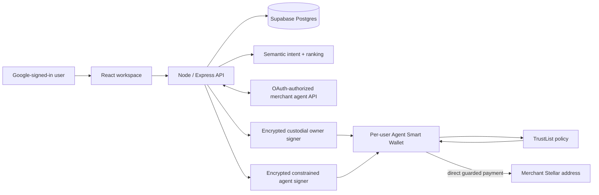

# JarvisPayz Agent

JarvisPayz is a **testnet shopping agent** that gives each signed-in user a managed Stellar smart wallet and lets them search and buy only through ecommerce stores they explicitly authorize with OAuth.

> Status: testnet beta. It uses test XLM only and is not approved for real-money or production-mainnet use.

## What the user experiences

1. Sign in with Google.
2. JarvisPayz creates or restores the same managed Stellar wallet linked to that account.
3. Fund the test wallet through Friendbot when needed.
4. Connect an ecommerce store by pasting its URL and completing that store's OAuth sign-in.
5. Ask naturally for an item. The agent interprets needs and constraints, searches only authorized stores, and presents one safe match.
6. The user approves once to reserve and verify the merchant order, then approves the exact XLM total a second time.
7. The Agent Smart Wallet checks the merchant, limits, and duplicate intent on Stellar before paying the merchant directly. A receipt and Stellar Explorer link are then shown.

No browser extension, seed phrase, or manually connected wallet is required for this testnet flow.

## Architecture



The merchant is never hardwired into the agent backend. A store is available only after its metadata discovery and OAuth authorization flow succeed for that user.

## Testnet contracts

| Purpose | Stellar testnet address |
| --- | --- |
| TrustList policy | `CCF7TJNLJUFTQYQSJH3BUBF6E6DPWGG4T6LIH5PVET4TJKOMNIHDEZKK` |
| SpendGuard (legacy / policy contract) | `CCM46FWI7N43QETVUQUS5QPIGCOEKIF4IKHEO2XNPIQGMMJC2FAARNMO` |
| Native-XLM Stellar Asset contract | `CDLZFC3SYJYDZT7K67VZ75HPJVIEUVNIXF47ZG2FB2RMQQVU2HHGCYSC` |
| Agent Smart Wallet WASM hash | `892f964953c5bb9fa2ebfe41b42e05f9f78c145fd6fc4482fc134ec4542d979b` |

Each user gets a separate Agent Smart Wallet contract (`C...` address). The wallet holds XLM and transfers directly to an approved merchant; it is not an escrow. The existing SpendGuard contract remains documented for policy compatibility, while the live purchase path is enforced by the Agent Smart Wallet plus TrustList.

## Safety model

- **Explicit store consent:** OAuth tokens are encrypted at rest and scoped to merchant search, checkout, and order confirmation.
- **Two explicit confirmations:** search never pays; checkout total is verified before the second approval.
- **On-chain policy:** merchant address, domain rule, per-transaction cap, daily cap, and one-time purchase intent are checked atomically before an XLM transfer.
- **Custodial signing:** the API can sign because this is the managed-wallet model requested for the project. Private keys are encrypted at rest with separate owner/agent scopes. Keep `MASTER_SECRET` in a managed secret store and rotate it deliberately.
- **Fail closed:** if semantic interpretation, merchant verification, policy sync, or payment verification fails, no payment is submitted.
- **Reconciliation:** merchant confirmation retries are durable in Postgres and never resubmit a payment.

## Repository layout

| Directory | Responsibility |
| --- | --- |
| `client/` | Vite + React workspace, responsive UI, accessibility states, optional client telemetry |
| `server/` | Express API, Google authentication, merchant OAuth, semantic orchestration, custody, payment and reconciliation |
| `contracts/` | Soroban TrustList, SpendGuard, Agent Smart Wallet, and shared policy interface |
| `supabase/migrations/` | PostgreSQL schema, RLS/policy data, durable reconciliation jobs |
| `docs/` | Testing, deployment, privacy, evidence, and recovery guidance |

## Local setup

Prerequisites: Node.js 24+, Rust/Cargo, Stellar CLI if redeploying contracts, and a Supabase project.

1. Copy `server/.env.example` to `server/.env` and provide server-only secrets and Supabase connection string.
2. Copy `client/.env.example` to `client/.env` and set the public Google client ID.
3. Apply the schema with `npx supabase db push` from the repository root.
4. Install and run the server:

   ```powershell
   cd server
   npm install
   npm run dev
   ```

5. Install and run the client in a second terminal:

   ```powershell
   cd client
   npm install
   npm run dev
   ```

See [deployment guidance](docs/DEPLOYMENT.md) before exposing the testnet build publicly.

## Verification commands

```powershell
cd client; npm run lint; npm run test; npm run build
cd ../server; npm test
cd ..; cargo test --workspace; cargo build --workspace --release
```

The manual end-to-end matrix is in [docs/TESTING.md](docs/TESTING.md). It covers success, policy rejection, duplicate approval, OAuth revocation, merchant outage, expired checkout, and reconciliation.

## Privacy-safe monitoring and analytics

Sentry and PostHog are included but disabled by default. Add their free-tier values only through ignored environment files or deployment secrets:

- `SENTRY_DSN` / `VITE_SENTRY_DSN` for error monitoring.
- `VITE_POSTHOG_KEY` for aggregate product events.

The integration intentionally excludes chat text, wallet addresses, XLM amounts, delivery data, OAuth tokens, headers, cookies, and secrets. It also disables session recording and automatic event capture. Details: [docs/PRIVACY.md](docs/PRIVACY.md).

## Recovery

The protected pre-hardening baseline is commit [`902aafb`](RECOVERY.md). Read [RECOVERY.md](RECOVERY.md) before reverting anything; the documented procedure makes the working tree recoverable without pushing or rewriting remote history.

## Public evidence checklist

The agent itself does not have a verified public demo URL in this repository yet. Do not present the merchant demo as an agent deployment. Before submission, capture the required screenshots and demo video listed in [docs/evidence/README.md](docs/evidence/README.md), then replace the placeholders below.

| Submission item | Add here when ready |
| --- | --- |
| Live testnet agent demo | `ADD_PUBLIC_AGENT_URL_HERE` |
| Desktop product UI screenshot | `docs/evidence/dashboard-desktop.png` |
| Mobile responsive screenshot | `docs/evidence/dashboard-mobile.png` |
| Monitoring / analytics screenshot | `docs/evidence/observability.png` |
| Stellar Explorer payment proof | `ADD_TESTNET_TRANSACTION_URL_HERE` |
| Demo video | `ADD_DEMO_VIDEO_URL_HERE` |

### Screenshot space

<!-- Add the desktop dashboard screenshot here once captured. -->


<!-- Add the mobile responsive screenshot here once captured. -->


Keep all evidence redacted: never show private keys, Google account details, OAuth tokens, delivery data, database URLs, or deployment credentials.
