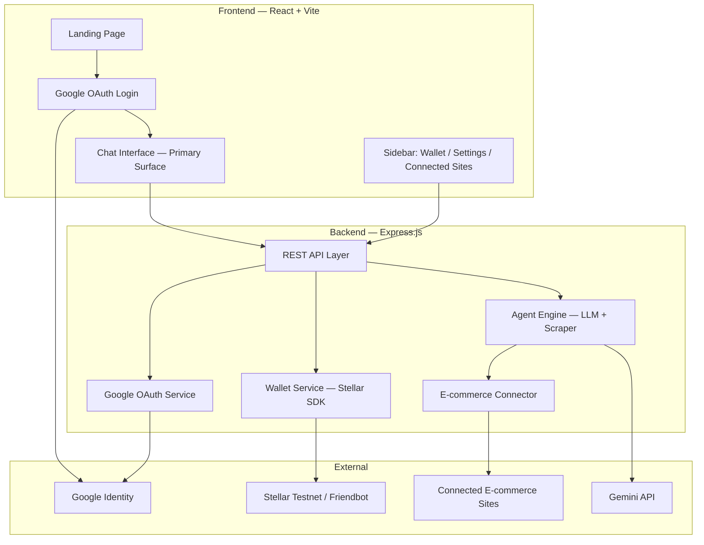
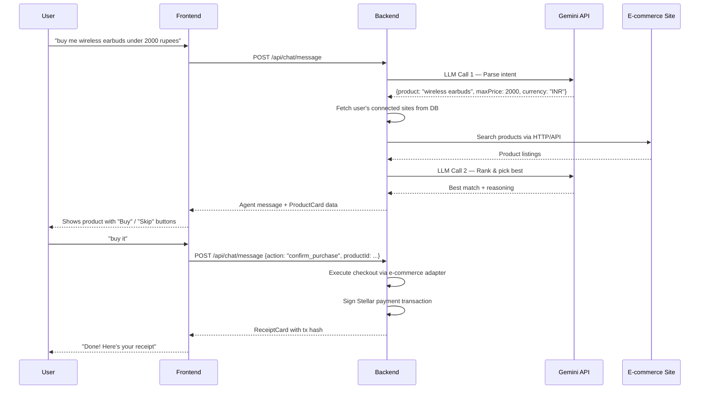
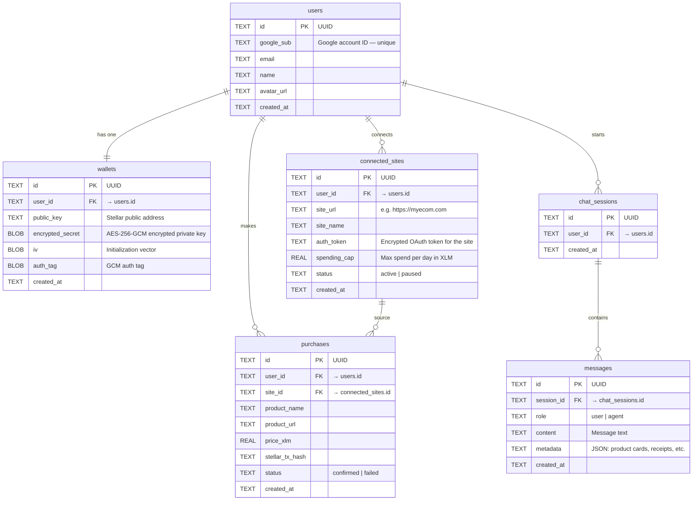

# JarvisPayz — AI-Powered Autonomous Shopping Agent

Full-stack web application: React + Vite frontend, Express backend, Stellar testnet wallet (custodial), Google OAuth, and an LLM-driven shopping agent that browses connected e-commerce sites and purchases on the user's behalf.

---

## High-Level Architecture



---

## Core Design Decisions

| Decision | Choice | Rationale |
|---|---|---|
| **Frontend framework** | React + Vite | Fast DX, modern tooling, your existing ecommerce is likely React-compatible |
| **Backend** | Express.js (Node) | Same language as frontend, excellent Stellar SDK support (`@stellar/stellar-sdk`) |
| **Database** | SQLite via `better-sqlite3` (dev) → easily swappable to PostgreSQL later | Zero config for MVP, file-based, perfect for prototyping |
| **Wallet model** | Custodial — server generates + stores encrypted keypairs | Matches your spec: user never installs a browser extension |
| **Key encryption** | AES-256-GCM, key derived from a server-held master secret + user's Google sub ID | User's private key never leaves the server unencrypted |
| **Auth** | Google OAuth 2.0 via `google-auth-library` | Your spec requirement |
| **LLM** | Google Gemini API (free tier available) | Intent parsing + product ranking |
| **E-commerce connector** | HTTP scraping + structured API adapter per connected site | Your ecommerce is the first adapter; others connect via the "Connect Site" flow |
| **Styling** | Vanilla CSS with a custom design system | Per your project guidelines |

---

## Phase Breakdown

---

### Phase 1 — Project Scaffolding + Landing Page

**Goal**: Set up the monorepo structure, install dependencies, create a production-quality landing page with hero section, features, how-it-works, and footer.

**Deliverables**:
```
agent/
├── client/                    # React + Vite frontend
│   ├── public/
│   ├── src/
│   │   ├── assets/
│   │   ├── components/
│   │   │   ├── Navbar.jsx
│   │   │   ├── Hero.jsx
│   │   │   ├── Features.jsx
│   │   │   ├── HowItWorks.jsx
│   │   │   ├── Footer.jsx
│   │   ├── pages/
│   │   │   └── Landing.jsx
│   │   ├── styles/
│   │   │   ├── design-tokens.css
│   │   │   ├── global.css
│   │   │   └── landing.css
│   │   ├── App.jsx
│   │   └── main.jsx
│   ├── index.html
│   ├── vite.config.js
│   └── package.json
├── server/                    # Express backend (skeleton)
│   ├── package.json
│   └── index.js               # Placeholder
├── .gitignore
└── idea.txt
```

**What gets built**:
- Vite + React project initialized
- Design system: CSS custom properties (colors, fonts, spacing, radii, shadows)
- Stunning landing page:
  - **Navbar** — Logo, nav links, "Get Started" CTA
  - **Hero** — Big headline ("Your AI Shopping Agent"), subtext, animated gradient background, CTA button
  - **Features grid** — 4 cards: Custodial Wallet, AI Shopping, On-Chain Receipts, Spending Controls
  - **How It Works** — 3-step visual flow: Sign In → Connect Store → Let the Agent Shop
  - **Footer** — Links, copyright
- Smooth scroll, micro-animations, responsive design
- `.gitignore` updated

---

### Phase 2 — Google OAuth + Custodial Stellar Wallet

**Goal**: User signs in with Google → backend creates (or retrieves) a Stellar testnet keypair tied to that Google account → frontend shows the wallet address + balance.

**Deliverables**:
```
server/
├── src/
│   ├── index.js               # Express app entry
│   ├── config/
│   │   └── env.js             # Environment config
│   ├── middleware/
│   │   └── auth.js            # JWT verification middleware
│   ├── routes/
│   │   ├── auth.routes.js     # POST /api/auth/google
│   │   └── wallet.routes.js   # GET /api/wallet, POST /api/wallet/fund
│   ├── services/
│   │   ├── auth.service.js    # Google token verification, JWT issue
│   │   ├── wallet.service.js  # Keypair gen, encrypt/decrypt, Stellar ops
│   │   └── crypto.service.js  # AES-256-GCM encrypt/decrypt
│   └── db/
│       ├── database.js        # SQLite connection
│       └── schema.sql         # users, wallets tables
├── .env.example
└── package.json

client/src/
├── contexts/
│   └── AuthContext.jsx        # Google auth state
├── components/
│   ├── GoogleLoginButton.jsx
│   └── WalletCard.jsx         # Shows address, balance, fund button
├── pages/
│   └── Dashboard.jsx          # Post-login main page
└── services/
    └── api.js                 # Axios instance with JWT interceptor
```

**Backend logic**:
1. `POST /api/auth/google` — receives Google ID token → verifies with Google → checks DB for existing user → if new, generates Stellar keypair, encrypts private key with AES-256-GCM (key = HMAC(MASTER_SECRET, googleSubId)), stores encrypted key + public key in DB → issues JWT
2. `GET /api/wallet` — returns public address + balance (fetched from Stellar Horizon)
3. `POST /api/wallet/fund` — calls Stellar Friendbot to fund the testnet account

**Frontend logic**:
1. Google Sign-In button using `@react-oauth/google`
2. On login success → send ID token to backend → receive JWT → store in memory (not localStorage for security)
3. Fetch wallet info → display address + balance
4. "Fund Wallet" button → calls Friendbot endpoint

**Key security detail**: Private key is encrypted at rest. Decryption only happens server-side, in-memory, at the moment of signing a transaction. The decrypted key is never logged, never sent to the frontend, and never persisted unencrypted.

> [!IMPORTANT]
> I need your **Google Cloud OAuth Client ID** to implement this. You'll need to create one at [Google Cloud Console](https://console.cloud.google.com/apis/credentials). I'll use a placeholder for now and you'll fill it in via `.env`.

---

### Phase 3 — Chat Interface + Agent Engine (Core)

**Goal**: Build the primary chat interface and the agent backend that parses user intent, searches connected stores, and presents products for confirmation.

**Deliverables**:
```
client/src/
├── components/
│   ├── chat/
│   │   ├── ChatWindow.jsx     # Main chat container
│   │   ├── MessageBubble.jsx  # User + agent message bubbles
│   │   ├── ProductCard.jsx    # In-chat product display
│   │   ├── ConfirmationCard.jsx # "Shall I buy this?" card
│   │   ├── ReceiptCard.jsx    # Post-purchase receipt
│   │   └── TypingIndicator.jsx
│   └── layout/
│       ├── AppLayout.jsx      # Sidebar + chat layout
│       └── Sidebar.jsx        # Wallet info, settings, connected sites
├── styles/
│   ├── chat.css
│   └── sidebar.css

server/src/
├── routes/
│   └── chat.routes.js         # POST /api/chat/message
├── services/
│   ├── agent.service.js       # Orchestrator: intent → search → rank → respond
│   ├── llm.service.js         # Gemini API wrapper
│   ├── intent.service.js      # LLM Call 1: parse user message → structured intent
│   └── product.service.js     # LLM Call 2: rank products, pick best match
```

**Agent flow** (for a message like "buy me wireless earbuds under 2000 rupees"):



**Chat features**:
- Streaming-style message appearance (typewriter effect for agent responses)
- Product cards with image, name, price, and agent's reasoning
- Confirmation flow: user must explicitly confirm before purchase
- Receipt card: shows product, price, Stellar transaction hash, link to explorer
- Message history (stored server-side per user)

---

### Phase 4 — E-commerce Connector + Site Management

**Goal**: Let users connect their e-commerce accounts and manage which sites the agent can shop from.

**Deliverables**:
```
client/src/
├── components/
│   ├── settings/
│   │   ├── ConnectedSites.jsx   # List of connected sites + "Connect New"
│   │   ├── ConnectSiteModal.jsx # URL input + OAuth flow trigger
│   │   ├── SpendingCaps.jsx     # Per-site spending limit editor
│   │   └── SettingsPanel.jsx    # Container for settings UI

server/src/
├── routes/
│   └── sites.routes.js          # CRUD for connected sites
├── services/
│   ├── site.service.js          # Site connection management
│   └── adapters/
│       ├── adapter.base.js      # Base adapter interface
│       └── ecommerce.adapter.js # Your test ecommerce adapter
├── db/
│   └── schema.sql               # + connected_sites, spending_caps tables
```

**Connect a site flow**:
1. User clicks "Connect New Site" → enters the e-commerce URL
2. Backend validates the URL and initiates Google OAuth for that site (since your ecommerce uses Google OAuth too — same Google account links them)
3. On success, the site is added to the user's connected sites list with a default spending cap
4. The user can adjust the per-site spending cap and remove sites

**Adapter pattern**: Each connected e-commerce site gets an "adapter" — a module that knows how to:
- Search products (via API or structured HTTP)
- Add to cart
- Execute checkout
- Your test ecommerce will be the first adapter, with hardcoded knowledge of its API routes

> [!IMPORTANT]
> **Question**: Does your e-commerce site expose REST API endpoints for search/cart/checkout, or will we need to interact with it through HTML scraping? Knowing its API structure will determine how I build the first adapter. I'll assume REST API endpoints exist and build accordingly — we can adjust when we connect them.

---

### Phase 5 — Stellar Payment + On-Chain Receipts

**Goal**: When the user confirms a purchase, the agent executes a Stellar payment and logs an on-chain receipt.

**Deliverables**:
```
server/src/
├── services/
│   ├── payment.service.js     # Build + sign + submit Stellar transactions
│   └── receipt.service.js     # Emit on-chain receipt events (memo-based for MVP)
```

**Payment flow**:
1. User confirms purchase → backend decrypts the user's Stellar private key in memory
2. Builds a Stellar payment transaction: user's account → merchant's Stellar address, amount = product price in XLM
3. Adds a memo with purchase metadata hash
4. Signs with the user's key → submits to Stellar testnet
5. Returns the transaction hash → displayed in the ReceiptCard
6. Clears decrypted key from memory immediately

**For MVP**: We use transaction memos for receipt attestation rather than deploying a full Soroban contract. The Soroban contracts (TrustList, SpendGuard) are a future enhancement that can be layered on top.

> [!NOTE]
> The Soroban smart contracts (TrustList, SpendGuard, receipt attestation) mentioned in your idea.txt are architecturally important but complex. For the MVP, I recommend implementing the spending policy logic server-side (in the DB/backend) and Stellar payments with memo-based receipts. This gives us the full user flow working end-to-end. We can then add Soroban contracts as a Phase 6 upgrade without changing the UX.

---

### Phase 6 — Polish, Security & Production Readiness

**Goal**: Final polish pass — error handling, loading states, responsive design audit, security hardening, and overall production feel.

**Deliverables**:
- Comprehensive error handling (network errors, auth failures, insufficient balance, checkout failures)
- Loading skeletons for wallet, chat, and product cards
- Toast notifications for success/error events
- Responsive design audit (mobile, tablet, desktop)
- Rate limiting on API endpoints
- Input sanitization
- CORS configuration
- Security headers (helmet)
- Session management improvements
- Purchase history page (pulled from DB + Stellar transaction history)
- 404 page
- SEO meta tags

---

## Data Model



---

## Open Questions

> [!IMPORTANT]
> **1. Google OAuth Client ID**: Do you already have a Google Cloud project with OAuth credentials set up? If not, I'll include instructions for creating one.

> [!IMPORTANT]
> **2. E-commerce API**: Does your test e-commerce site have REST API endpoints (e.g., `/api/products/search?q=earbuds`, `/api/cart/add`, `/api/checkout`)? Or is it a standard frontend-rendered site where we'd need to scrape product data? This determines the adapter strategy.

> [!IMPORTANT]
> **3. Gemini API Key**: Do you have a Google Gemini API key for the LLM calls? I'll use `@google/generative-ai` SDK.

> [!IMPORTANT]
> **4. Merchant Stellar Address**: For the payment flow, we need a Stellar testnet address that represents the merchant (your e-commerce store). Should I generate one, or do you have one?

---

## Verification Plan

### After Each Phase
- Run `npm run dev` on both client and server
- Verify all new pages/components render correctly
- Test the specific feature flow (login, wallet creation, chat, etc.)

### End-to-End Test (After Phase 5)
1. Open landing page → click "Get Started"
2. Sign in with Google → see wallet address and 0 XLM balance
3. Click "Fund Wallet" → balance shows 10,000 XLM (testnet)
4. Connect the test e-commerce site
5. Type "buy me earbuds" in chat
6. Agent searches the store, returns a product card
7. Type "buy it" → agent executes checkout + Stellar payment
8. Receipt card appears with Stellar tx hash
9. Verify transaction on Stellar testnet explorer

### Automated
- Backend: Jest tests for auth, wallet, and agent services
- Frontend: Manual visual testing (production-quality UI is hard to unit-test meaningfully)
